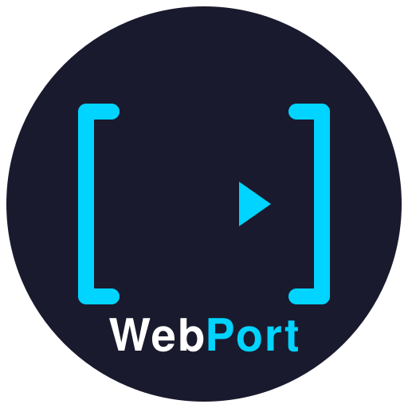

<p align="center">
  
</p>

<h1 align="center">WebPort</h1>

<p align="center">
  <strong>Reverse-engineer any website. Port it anywhere.</strong>
</p>

<p align="center">
  <a href="#quick-start">Quick Start</a> &bull;
  <a href="#pipeline-stages">Pipeline</a> &bull;
  <a href="#cli-reference">CLI</a> &bull;
  <a href="#configuration">Configuration</a> &bull;
  <a href="#architecture">Architecture</a>
</p>

---

WebPort is a modular, multi-stage pipeline that crawls websites (especially WordPress), extracts content and relationships, generates documentation, and produces modern framework code (Next.js) &mdash; from URL to ZIP archive.

## Features

- **5-stage pipeline**: `crawl` &rarr; `scrape` &rarr; `analyze` &rarr; `generate` &rarr; `archive`
- **Config-driven scraping**: CSS selectors defined in YAML &mdash; no hardcoded logic
- **WordPress-native**: REST API crawling with CPT discovery, taxonomy support, raw JSON export
- **Relationship extraction**: M2M relationships scraped from HTML (e.g., posts &harr; participants)
- **Code generation**: Next.js 14 with Prisma ORM, TypeScript, Tailwind CSS
- **Documentation generation**: PRD, data dictionary, database schema, tech spec, component inventory
- **Resume support**: Checkpoint system for interrupted crawls
- **Production infrastructure**: Rate limiting, circuit breakers, SSRF protection, retry with backoff

## Quick Start

```bash
# Install
pip install -e ".[dev]"

# Full pipeline — crawl, scrape, analyze, generate, archive
webport pipeline https://example.com -y

# Or run stages individually
webport crawl https://example.com -y
webport scrape https://example.com -y
webport analyze sites/example.com
webport generate sites/example.com -y
webport archive sites/example.com
```

## Installation

```bash
# From source
git clone https://github.com/webport/webport.git
cd webport
pip install -e ".[dev]"

# Install browser for Playwright (optional)
playwright install chromium
```

**Requirements:** Python 3.10+

## CLI Reference

| Command | Description | Example |
|---------|-------------|---------|
| `webport crawl <url>` | Crawl via WordPress REST API | `webport crawl https://example.com` |
| `webport scrape <url>` | Scrape supplemental HTML data | `webport scrape https://example.com` |
| `webport analyze <site_dir>` | Generate documentation | `webport analyze sites/example.com` |
| `webport generate <site_dir>` | Generate framework code | `webport generate sites/example.com` |
| `webport archive <site_dir>` | Create ZIP archive | `webport archive sites/example.com` |
| `webport pipeline <url>` | Run full pipeline | `webport pipeline https://example.com` |
| `webport check <url>` | Health check a URL | `webport check https://example.com` |

### Pipeline Options

```bash
# Run specific stages
webport pipeline https://example.com --stages crawl,scrape

# Skip specific stages
webport pipeline https://example.com --skip archive

# Use a config file
webport pipeline https://example.com --config sites/example.com/webport.yaml

# Skip confirmation prompts
webport pipeline https://example.com -y
```

## Configuration

Each site is configured via `sites/{domain}/webport.yaml`:

```yaml
domain: example.com
base_url: https://example.com
name: Example Site
site_type: wordpress

# Rate limiting
rate_limit_delay: 0.5
max_concurrent: 4

# WordPress crawl config
wordpress:
  custom_post_types:
    - product
    - testimonial
  taxonomies:
    - brand
  include_standard:
    - posts
    - pages
    - categories
    - tags
    - media

# HTML scraping config
scrape:
  rate_limit_delay: 0.5
  max_concurrent: 4
  relationships:
    - source_json: wp_posts.json
      url_field: link
      target_link:
        selectors: [".related-items a"]
        attribute: href
        multiple: true
      target_container:
        selectors: [".related-items"]
      output_file: post_relationships.json
  details:
    - source_json: wp_posts.json
      url_field: link
      fields:
        event_date:
          selectors: [".event-date", "time[datetime]"]
          attribute: datetime
      output_file: post_details.json

# Analysis config
analyze:
  docs: [PRD, data-dictionary, database-schema, tech-spec]
  use_ai: false

# Generation config
generate:
  target: nextjs
  typescript: true
  styling: tailwind
  prisma: true
```

### Environment Variables

Configuration can also be set via environment variables with the `WEBPORT_` prefix:

```bash
export WEBPORT_TARGET_URL="https://example.com"
export WEBPORT_CRAWLER__MAX_PAGES=500
```

## Pipeline Stages

### 1. Crawl

Fetches data from WordPress REST API endpoints. Discovers custom post types and taxonomies automatically. Saves raw JSON to `sites/{domain}/input/wp_*.json`.

### 2. Scrape

Visits HTML pages and extracts supplemental data not available via API: M2M relationships, professional titles, event details. Driven by CSS selectors in `webport.yaml`.

### 3. Analyze

Generates Markdown documentation from crawl data: PRD, data dictionary, database schema, tech spec, component inventory, deployment guide.

### 4. Generate

Produces a complete Next.js 14 project with Prisma ORM, TypeScript, Tailwind CSS. Includes database schema, seed script, layouts, pages, and components.

### 5. Archive

Creates a ZIP file containing all input data, output docs, and generated code. Excludes `node_modules`, `.next`, and dev artifacts.

## Architecture

```
src/webport/
├── cli/main.py           # Typer CLI with all commands
├── core/
│   ├── config.py         # WebPortConfig + SiteConfig (Pydantic)
│   ├── models.py         # CrawledPage, StageResult, ScrapeResult
│   ├── exceptions.py     # Exception hierarchy
│   └── ...               # checkpoint, retry, security, plugins
├── crawlers/             # WordPress + static site crawlers
├── scrapers/             # Config-driven HTML scrapers
│   ├── base.py           # SelectorEngine + BaseScraper
│   ├── relationship.py   # M2M relationship extraction
│   └── detail.py         # Supplemental field extraction
├── analyzers/            # Documentation generators
├── generators/           # Code generators (Next.js)
│   └── nextjs/
│       ├── generator.py  # Project scaffolding
│       └── prisma.py     # Schema + seed generation
└── pipeline/             # Pipeline orchestration
    ├── orchestrator.py   # Stage sequencing
    ├── stages.py         # Stage enum + dependencies
    └── archive.py        # ZIP packaging
```

### Data Flow

```
URL
 └─ crawl ─────────> sites/{domain}/input/wp_*.json
     └─ scrape ────> sites/{domain}/input/*_details.json
         └─ analyze > sites/{domain}/output/docs/*.md
             └─ generate > sites/{domain}/output/nextjs/
                 └─ archive > site_{domain}.zip
```

## Development

```bash
# Setup
pip install -e ".[dev]"

# Run tests
pytest                    # All tests (169+)
pytest -m unit            # Unit tests only
pytest -m integration     # Integration tests

# Linting
ruff check src tests
black src tests
mypy src
```

## License

MIT
